# Library Management System

A console-based Library Management System built in Java demonstrating core OOP principles, SOLID design, and classic design patterns. All data is stored in-memory using Java collections — no database or external APIs required.


---

## Features

### Core
- **Book Management** — Add, remove, update books; search by title, author, or ISBN
- **Patron Management** — Add, remove, update patrons; view full borrowing history
- **Lending** — Checkout and return books with per-branch copy tracking
- **Inventory** — View available and borrowed books per branch

### Optional 
- **Multi-branch** — Each branch independently tracks its own copy counts; transfer copies between branches
- **Reservations** — Reserve an unavailable book; reservation is automatically fulfilled via the Observer pattern when a copy is returned
- **Recommendations** — Suggests books by authors the patron has already read, excluding already-read titles

---

## OOP Concepts

| Concept | Implementation |
|---|---|
| **Encapsulation** | All model fields are `private`; accessed only through getters/setters |
| **Inheritance** | `Book`, `Patron`, `Branch` all extend the abstract `LibraryEntity` base class |
| **Polymorphism** | Each subclass overrides `getDisplayInfo()` with its own format; `LibraryEntity.toString()` delegates to it |
| **Abstraction** | `LibraryEntity` is abstract; 6 service interfaces define contracts independently of implementation |

---

## SOLID Principles

| Principle | How it is applied |
|---|---|
| **SRP** | Each class has one clear responsibility — `Validator` only validates, `IdGenerator` only generates IDs, each service only manages its own domain |
| **OCP** | New observers can be added (e.g. email, SMS) without touching existing code — only registered in `Main` |
| **LSP** | All `*Impl` classes honour the full contract of their interface — no method throws `UnsupportedOperationException` |
| **ISP** | `BookService`, `PatronService`, `LibraryService`, `BranchService`, `ReservationService`, and `RecommendationService` are separate focused interfaces |
| **DIP** | Services declare dependencies as interfaces, not concrete types; `LibraryServiceImpl` injects `PatronService`, not `PatronServiceImpl` |

---

## Design Patterns

### Observer Pattern
`LibraryObserver` is an interface with five event methods. `NotificationService` and `ReservationServiceImpl` both implement it. `LibraryServiceImpl` maintains a `List<LibraryObserver>` and fires events on checkout and return. When a book is returned, `ReservationServiceImpl.onBookReturned()` automatically fulfils the first pending reservation.

```
LibraryObserver (interface)
    ├── NotificationService       → logs and prints events to console
    └── ReservationServiceImpl    → auto-fulfils pending reservations on return
```

### Factory Pattern
`BookFactory.create()` and `PatronFactory.create()` are static methods that validate all inputs via `Validator` before constructing the object. Patron ID generation is centralised here via `IdGenerator`.

```
BookFactory.create(isbn, title, author, year)  → validates → new Book(...)
PatronFactory.create(name, email, phone)        → validates → new Patron(IdGenerator.generatePatronId(), ...)
```

---

## Collections

| Collection | Location | Reason |
|---|---|---|
| `Map<String, Patron>` | `PatronServiceImpl` | O(1) lookup by patron ID |
| `Map<String, LendingRecord>` | `LibraryServiceImpl` | O(1) lookup by record ID for returns |
| `Map<Book, Integer>` | `Branch` (×2: total + available copies) | Tracks copy counts per book per branch |
| `List<Branch>` | Shared across services | Ordered collection, iterated for searches |
| `List<LibraryObserver>` | `LibraryServiceImpl`, `BranchServiceImpl` | Multiple observers notified in registration order |
| `List<LendingRecord>` | `Patron.borrowingHistory` | Ordered history, appended on each checkout |
| `Set<String>` | `RecommendationServiceImpl` | O(1) deduplication of read authors and ISBNs |

---

## Class Diagram

```mermaid
classDiagram
    direction TB

    class LibraryEntity {
        <<abstract>>
        -String id
        -LocalDateTime createdAt
        +getId() String
        +getCreatedAt() LocalDateTime
        +getDisplayInfo()* String
        +toString() String
    }

    class Book {
        -String isbn
        -String title
        -String author
        -int publicationYear
        +getDisplayInfo() String
    }

    class Patron {
        -String name
        -String email
        -String phone
        -List~LendingRecord~ borrowingHistory
        +getDisplayInfo() String
        +addBorrowingRecord()
    }

    class Branch {
        -String name
        -String address
        -Map~Book,Integer~ totalCopies
        -Map~Book,Integer~ availableCopies
        +getDisplayInfo() String
        +checkoutBook()
        +returnBook()
        +getAvailableBooks() List~Book~
    }

    class LendingRecord {
        -String recordId
        -Book book
        -Patron patron
        -LocalDate checkoutDate
        -LocalDate returnDate
        -boolean isReturned
        +markAsReturned()
    }

    class Reservation {
        -String reservationId
        -Book book
        -Patron patron
        -LocalDate reservationDate
        -ReservationStatus status
        +fulfil()
        +cancel()
        +isPending() boolean
    }

    class ReservationStatus {
        <<enumeration>>
        PENDING
        FULFILLED
        CANCELLED
    }

    class Searchable~T~ {
        <<interface>>
        +searchByName(String) List~T~
        +searchById(String) T
    }

    class BookService {
        <<interface>>
        +addBook()
        +removeBook()
        +updateBook()
        +getAllBooks() List~Book~
        +searchByTitle() List~Book~
        +searchByAuthor() List~Book~
    }

    class PatronService {
        <<interface>>
        +addPatron()
        +removePatron()
        +updatePatron()
        +getAllPatrons() List~Patron~
        +getBorrowingHistory() List~LendingRecord~
    }

    class LibraryService {
        <<interface>>
        +addObserver()
        +checkoutBook() LendingRecord
        +returnBook() LendingRecord
        +getAvailableBooks() List~Book~
        +getBorrowedBooks() List~Book~
        +getAllLendingRecords() List~LendingRecord~
    }

    class BranchService {
        <<interface>>
        +addBranch()
        +removeBranch()
        +getBranchById() Branch
        +getAllBranches() List~Branch~
        +transferBook()
    }

    class ReservationService {
        <<interface>>
        +reserveBook() Reservation
        +cancelReservation()
        +getReservationsForBook() List~Reservation~
        +getReservationsForPatron() List~Reservation~
    }

    class RecommendationService {
        <<interface>>
        +recommendBooks(String) List~Book~
    }

    class LibraryObserver {
        <<interface>>
        +onBookCheckedOut()
        +onBookReturned()
        +onBookReserved()
        +onReservationFulfilled()
        +onBookTransferred()
    }

    class BookServiceImpl { +implements BookService }
    class PatronServiceImpl { +implements PatronService }
    class LibraryServiceImpl {
        -List~LibraryObserver~ observers
        +addObserver()
    }
    class BranchServiceImpl { }
    class ReservationServiceImpl { }
    class RecommendationServiceImpl { }
    class NotificationService { }

    class BookFactory {
        +create(isbn, title, author, year)$ Book
    }
    class PatronFactory {
        +create(name, email, phone)$ Patron
    }
    class Validator {
        +validateNotEmpty()$
        +validateYear()$
        +validateCopies()$
        +validateEmail()$
        +validatePhone()$
        +validateIsbn()$
    }
    class IdGenerator {
        +generatePatronId()$ String
        +generateRecordId()$ String
        +generateReservationId()$ String
        +generateBranchId()$ String
    }

    LibraryEntity <|-- Book
    LibraryEntity <|-- Patron
    LibraryEntity <|-- Branch

    LendingRecord --> Book
    LendingRecord --> Patron
    Reservation --> Book
    Reservation --> Patron
    Reservation --> ReservationStatus

    Searchable~T~ <|.. BookService
    Searchable~T~ <|.. PatronService

    BookService <|.. BookServiceImpl
    PatronService <|.. PatronServiceImpl
    LibraryService <|.. LibraryServiceImpl
    BranchService <|.. BranchServiceImpl
    ReservationService <|.. ReservationServiceImpl
    RecommendationService <|.. RecommendationServiceImpl

    LibraryObserver <|.. NotificationService
    LibraryObserver <|.. ReservationServiceImpl
    LibraryServiceImpl o-- LibraryObserver : maintains list

    BookFactory ..> Book : creates
    PatronFactory ..> Patron : creates

    Validator <.. BookFactory : uses
    Validator <.. PatronFactory : uses
    Validator <.. BookServiceImpl : uses

    IdGenerator <.. PatronFactory : uses
    IdGenerator <.. LibraryServiceImpl : uses
    IdGenerator <.. ReservationServiceImpl : uses
```



---

## How to Run

### IntelliJ IDEA

1. Open IntelliJ IDEA → **File → Open** → select the project root folder
2. Wait for Maven to import dependencies (bottom status bar)
3. Navigate to `src/main/java/com/library/Main.java`
4. Click the green **▶ Run** button next to `public static void main`

### Maven Terminal

```bash
# Clone the repository
git clone <repository-url>
cd library-management-system

# Build the project
mvn clean install

# Run the application
mvn exec:java -Dexec.mainClass="com.library.Main"
```

---

## Sample Data

Loaded automatically on startup — no manual setup required.

| Type | ID | Details |
|---|---|---|
| Branch | B001 | Main Branch — 123 Main St |
| Branch | B002 | City Branch — 456 City Ave |
| Book | ISBN001 | *Clean Code* by Robert Martin (2008) — 3 copies @ Main |
| Book | ISBN002 | *The Pragmatic Programmer* by Andrew Hunt (1999) — 2 copies @ Main |
| Book | ISBN003 | *Refactoring* by Robert Martin (2018) — 2 copies @ City |
| Book | ISBN004 | *Design Patterns* by Gang of Four (1994) — 1 copy @ City |
| Patron | P001 | John Doe — john@email.com |
| Patron | P002 | Jane Smith — jane@email.com |

---

## Package Structure

```
src/main/java/com/library/
├── model/                        # Domain entities
│   ├── enums/                    # ReservationStatus enum
├── interfaces/                   # Service contracts
├── service/                      # Business logic implementations
├── observer/                     # Observer pattern (events + notifications)
├── factory/                      # Object creation with validation
├── exception/                    # Custom runtime exceptions
├── util/                         # Validator and IdGenerator utilities
└── Main.java                     # Entry point and console UI

src/main/resources/
└── logback.xml                   # Logging configuration
```

---

## Logging

All service activity is logged via SLF4J + Logback:
- **Console** — real-time output during the session
- **File** — `logs/library.log` with daily rolling, 30-day retention

Log levels used:
- `INFO` — successful operations (add, checkout, return, reservation fulfilled)
- `WARN` — business rule violations (e.g. reserving an available book)
- `ERROR` — exception conditions (book not found, patron not found, not available)
